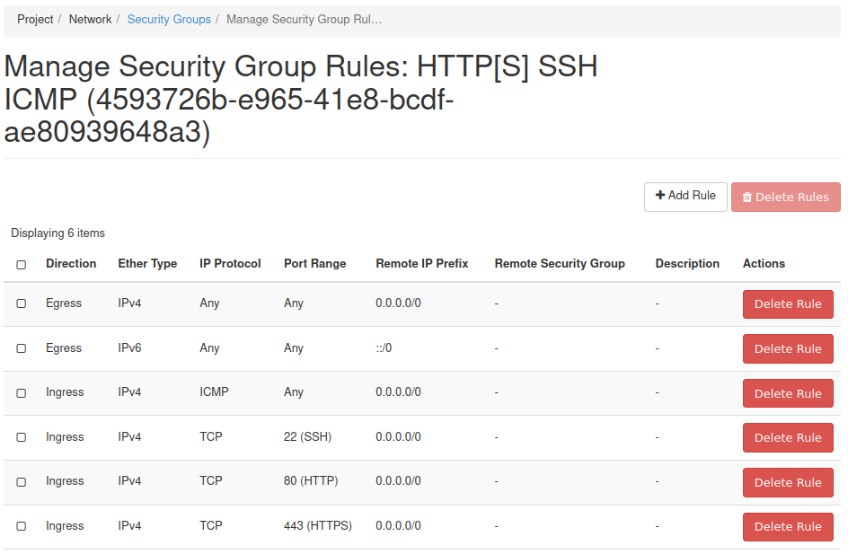
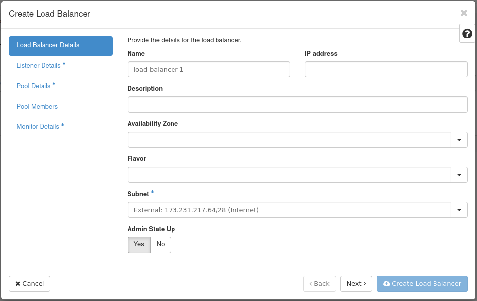
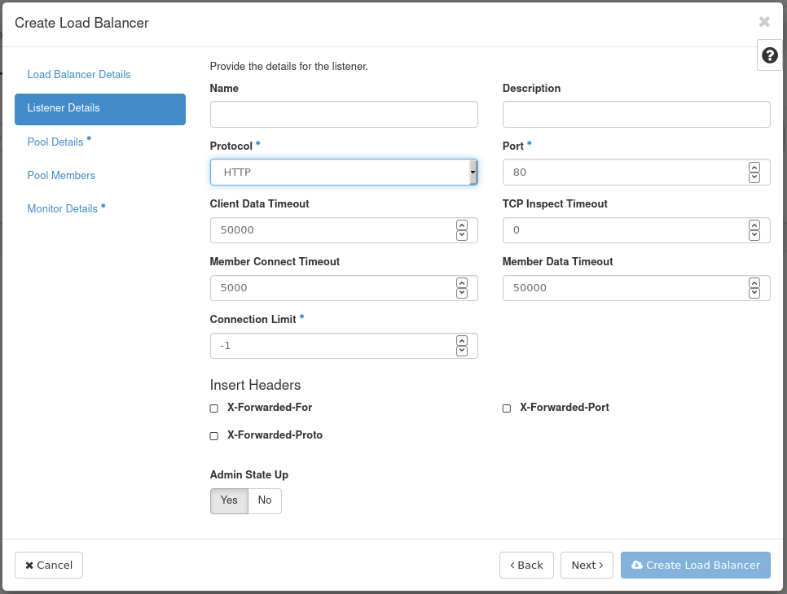
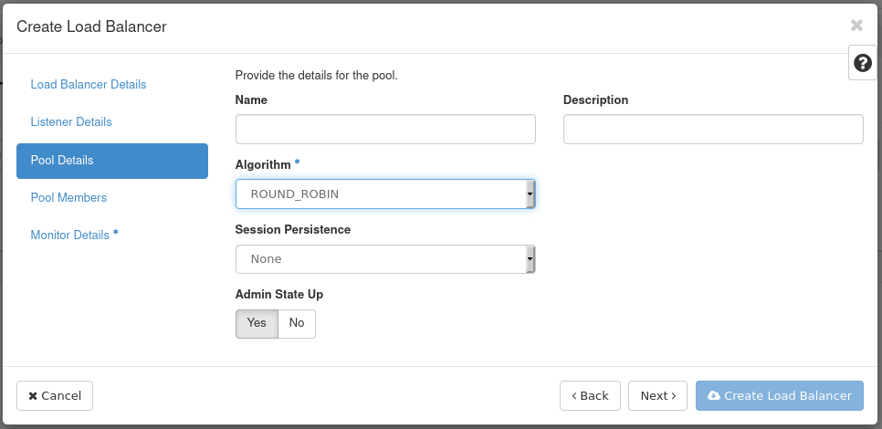
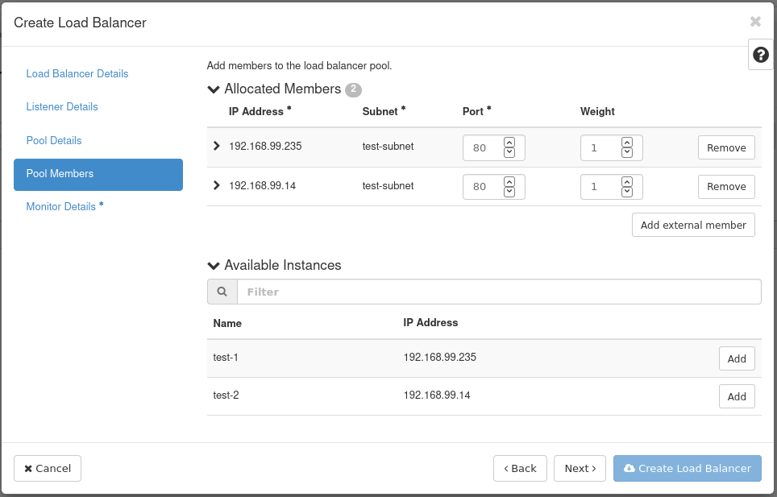
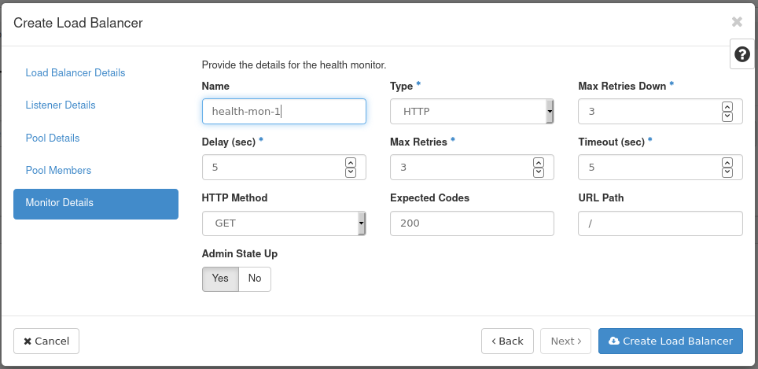

# How to Create a Load Balancer

Load Balancing in OpenStack is made possible by the
[Octavia](https://docs.openstack.org/octavia/latest/) service.

In this guide, you will learn how to create a load balancer to
distribute network traffic between two instances. The example load
balancer created will listen on an external, publicly reachable IP
address and route packets in a round-robin fashion across two instances
on an internal private network.

-----

## Prerequisites

Before getting started, the OpenStack project's quotas may need to be
adjusted and you should have an SSH key added.

### Project Quota

Before creating a load balancer, ensure your project's quotas are set
appropriately.

To see current project quotas, navigate in Horizon to **Project -\>
Compute -\> Overview**.

To adjust project quotas, as a user with the `admin` role, navigate in
Horizon to **Identity -\> Projects**, find the project in the list, and
from the drop down on the right, choose **Modify Quotas**.

This guide requires the following resources:

  - 2 instances
  - 2 VCPUs
  - 2GB RAM
  - 50GB Disk space
  - At least one floating IP, ideally 2
  - At least one IP from the External pool
  - 1 network
  - 1 router

**Note\!** -- Only an OpenStack administrator can modify projects.

### Project Roles

To create a load balancer, the project user's roles must be set to
either:

  - `admin`
  - `load-balancer_admin`

Alternatively, the user that owns a project can create a load balancer.

### SSH Key

You will need an SSH public key added to the project used to access the
instances over SSH to install NGINX.

-----

## Procedure

This section explains the steps needed to create a round robin load
balancer. To create this load balancer, first a network and router are
required. Next, security groups allowing specific network traffic need
to be created. Finally, two instances will be spun up and NGINX
installed to each. Once those steps are complete, the guide will walk
through creating the load balancer.

This guide does not go into full detail on how to create the private
network, router, security groups, and instances. For assistance with
creating these items see the [User's
Manual](https://central.openmetal.io/documentation/users-manual/home/).

-----

### Prepare Network, Router, and Security Groups

#### Create Network

To get started, you need to create a private network.

To create this network, load **Project -\> Network -\> Networks** in
Horizon and follow the **Create Network** link.

This example uses the private network called **test-net** with subnet
`192.168.99.0/24`:

-----

#### Create Router

After creating the private network, a router needs to be made. The
purpose of the router is to bridge the **External** network with the
private one.

To make the router, navigate to **Project -\> Network -\> Routers** in
Horizon and follow the **Create Router** link.

This example uses a router called **router-1** which connects the
**External** network and **test-net** networks together.

-----

#### Create Security Groups

The instances will require inbound network traffic for HTTP, HTTPS, SSH,
and ICMP.

You will need to create security groups allowing inbound traffic for
each type.

For this example, a single security group has been created allowing
inbound traffic for HTTP, HTTPS, SSH, and ICMP as can be seen in this
screenshot:

### Create and Prepare Instances

This load balancer will balance the load between two instances. Each
will run Ubuntu with a basic NGINX installation.

-----

#### Create Instances

Two instances need to be created for this demonstration.

Create them using these details:

  - **Operating System**: Ubuntu 20.04 (focal-amd64)
  - **Flavor**: `gp1.micro`
  - **Network**: The private network previously created
  - **Security Group**: Inbound HTTP, HTTPS, SSH, ICMP
  - **SSH key**: A key you can use to access instances over SSH

Note that in the instance creation form you can specify multiple
instances be created at once using the **Count** form option.

This example makes use of these two instances:

Once the instances are ready, assign a floating IP address to each one
so you can access them with SSH.

#### Install NGINX

Using each instance's floating IP, access each one and install NGINX.

Here is one way to accomplish this:

    ssh ubuntu@<floating-ip>
    sudo su -
    apt-get update && \
        apt-get install -y nginx && \
        echo $(hostname) > /var/www/html/index.html

The above uses SSH to login to one of the servers, then logs in as root,
installs NGINX using `apt-get`, and creates a basic, unique webpage with
the server's hostname as output.

This needs to take place on both servers.

### Create Load Balancer

With the previous steps complete, everything is prepared to create the
load balancer.

-----

**Step 1** -- Navigate to Load Balancer Form

To create a load balancer, in Horizon, navigate to **Project -\> Network
-\> Load Balancers** and follow the **Create Load Balancer** link.

**Step 2** -- Load Balancer Details

Certain details now need to be filled in.

The following are two main items to fill in on the first page:

  - **Name**: Specify a name for the load balancer
  - **Subnet**: Choose the **External** network

All other details are not required for this demonstration.

**Step 3** -- Listener Details

On this page, only the **Protocol** needs to be set.

Set the following:

  - **Protocol**: HTTP

**Step 4** -- Pool Details

This page only needs the **Algorithm** option set.

Set the following:

  - **Algorithm**: ROUND\_ROBIN

**Step 5** -- Pool Members

This page is where you will specify the instances for which to perform
load balancing.

Choose from **Available Instances** the two instances created
previously.

Next, set each instance's **Port** to port 80.

**Step 6** -- Monitor Details

For the Monitor Details, fill in a **Name** for the monitor and set
**Type** to HTTP.

Set the following:

  - **Name**: Name of the monitor
  - **Type**: HTTP

This concludes all details required. Click **Create Load Balancer** to
spawn a new load balancer.

**Step 7** -- Verify Load Balancer Creation

Next you will see the load balancer in the list and its **Provisioning
Status** will likely state, "Pending Create".

Allow the OpenStack services a small amount of time to create the load
balancer.

You will know the load balancer has been created successfully once
**Provisioning Status** reports "Active". Once this is the case, it's
time to test the load balancer.

**Step 8** -- Test Load Balancer

With all steps complete, find the public IP of the load balancer, which
is listed as the **IP Address** column in the load balancer listing,
point your browser to it, and refresh a few times. You should see the
hostname of each server oscillate upon each refresh.

-----

-----

-----

## Conclusion

This concludes the guide on how to create a load balancer in OpenStack.
Note this is a rudimentary example, but should be enough to get you
acquainted with the process. \<\<\<\<\<\<\< HEAD

\======= \>\>\>\>\>\>\> add\_ip\_blocks
