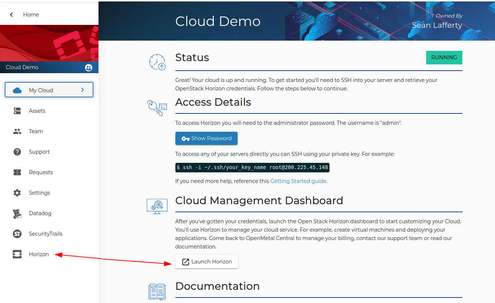
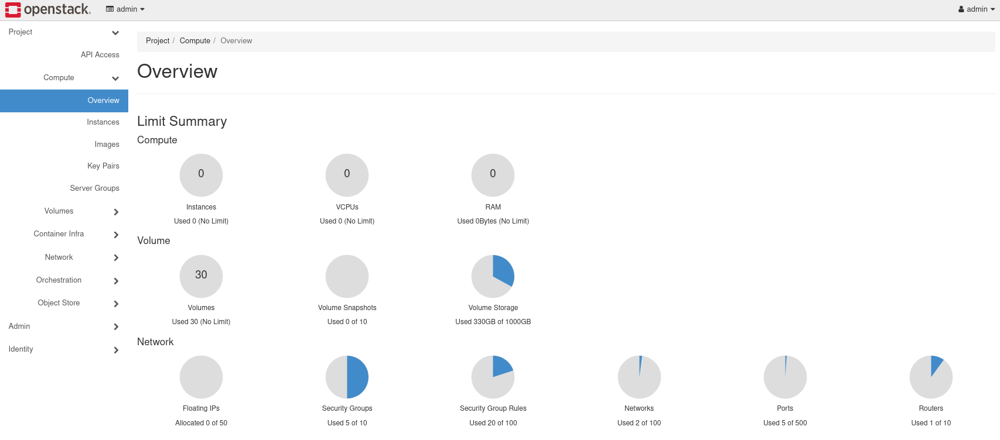

# Getting Started with OpenStack Horizon

## Introduction

To get started with using your cloud, we introduce Horizon, OpenStack's
dashboard. It is accessible through a web browser and allows a user to
interact with the cloud. As an administrator, most of the cloud can be
managed this way.

## Table of Contents

1. [How to Log in to Horizon](getting-started-with-horizon#how-to-log-in-to-horizon)

    1. [Log in to OpenMetal Central](getting-started-with-horizon#step-1-log-in-to-openmetal-central)

    2. [Navigate to Cloud's Details Page](getting-started-with-horizon#step-2-navigate-to-cloud-s-details-page)

    3. [Load Horizon URL](getting-started-with-horizon#step-3-load-horizon-url)

    4. [SSH into a Hardware Node, Obtain Horizon Password](getting-started-with-horizon#step-4-ssh-into-a-hardware-node-obtain-horizon-password)

        1. [Requirements to SSH into a node](getting-started-with-horizon#requirements-to-ssh-into-a-node)

    5. [Log in to Horizon](getting-started-with-horizon#step-5-log-in-to-horizon)

## How to Log in to Horizon

The Horizon administrator password is present in a file within the cloud
itself. This section walks you through the steps required to obtain this
password.

### Step 1: Log in to OpenMetal Central

To get started, navigate to [OpenMetal
Central](https://central.openmetal.io/) and log in.

**Figure 1:** OpenMetal Central Login Page

### Step 2: Navigate to Cloud's Details Page

Click **Manage** to the right for the cloud you're working with to load
this cloud's details page.

**Figure 2:** Cloud List

### Step 3: Load Horizon URL

Next, navigate to the **Horizon** link within the left sidebar located
as the last item in the list.

**Figure 3:** Horizon URL Location

### Step 4: SSH into a Hardware Node, Obtain Horizon Password

During cloud creation, your SSH public key was added to each hardware
node. With this key, you are able to log in as root using SSH. To SSH
in, ensure you have one node's IP address and the private key on the
system you use to access your cloud. To find your cloud's hardware node
IP addresses, click **Assets** on the cloud's details page.

**Figure 4:** Assets Page

The IP address for each node is listed under the **Public IP** column.
You can SSH into any of the nodes for this step. Select an IP from this
list, then use SSH to log in.

#### Requirements to SSH into a node

To SSH into a hardware node, ensure these requirements are met:

- Username: root
- Authentication: SSH key pair
- IP address of a hardware node

As an example, we demonstrate using SSH to log in to the first hardware
node, located by `173.231.254.165`. The SSH key file for this example is
`~/.ssh/id_rsa`. Ensure you specify the appropriate key and IP address
for this step.

For example:

    ssh -i ~/.ssh/id_rsa root@173.231.254.165

Once logged in, search for `keystone_admin_password` inside of
`/etc/kolla/passwords.yml`.

For example:

    # grep keystone_admin_password /etc/kolla/passwords.yml
    keystone_admin_password: xxxxxxxxxxxxxxxxxxxxxxxxxxxxxx

### Step 5: Log in to Horizon

You can now log in to Horizon using the credentials obtained from the
previous section. The username for the Horizon administrator account is
**admin**.

**Figure 5:** Horizon Login Page

When you log in to Horizon, your dashboard appears similar to the
following:

**Figure 6:** Horizon Dashboard
