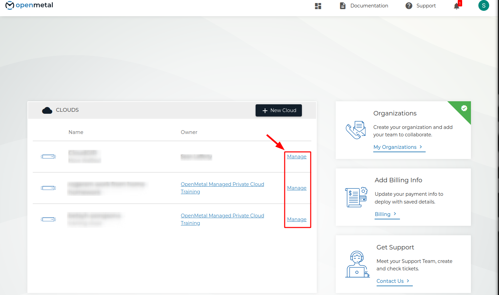
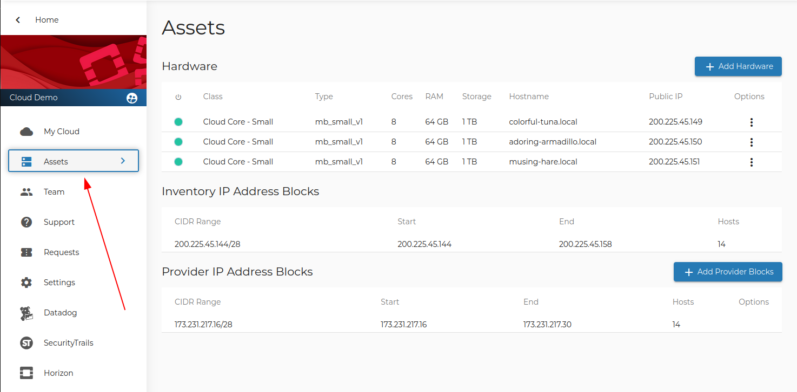
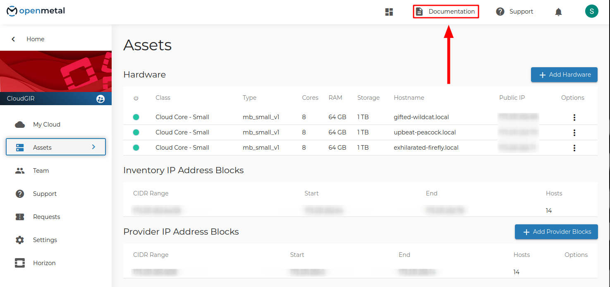
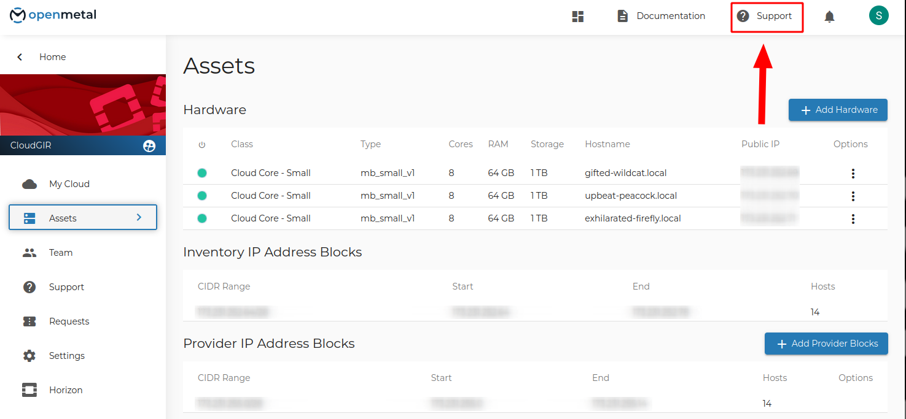
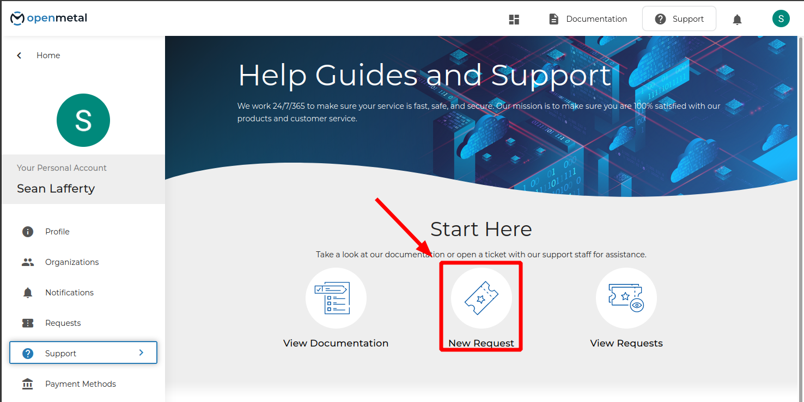
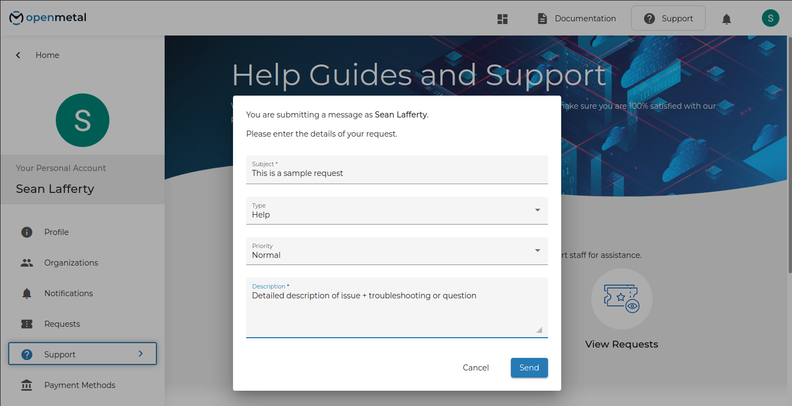
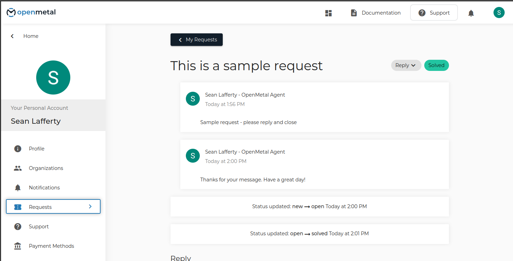

# Introduction to OpenMetal Central and Your Private Cloud Core

## Introduction

We begin by introducing you to OpenMetal Central and explain how to
obtain an overview of your Private Cloud. Next, we detail where to view
the assets that comprise your cloud, point you to existing
documentation, and how to submit and view support requests.

## Table of Contents

1. [A Brief Overview of your OpenMetal Private
    Cloud](intro-to-openmetal-private-cloud#a-brief-overview-of-your-openmetal-private-cloud)

2. [How to View your Hardware
    Assets](intro-to-openmetal-private-cloud#how-to-view-your-hardware-assets)

3. [How to Get Support](intro-to-openmetal-private-cloud#how-to-get-support)

    1. [How to Access OpenMetal
        Documentation](intro-to-openmetal-private-cloud#how-to-access-openmetal-documentation)
    2. [How to Submit a Support
        Ticket](intro-to-openmetal-private-cloud#how-to-submit-a-support-ticket)

## A Brief Overview of Your OpenMetal Private Cloud

OpenMetal Private Clouds are deployed with OpenStack to three bare metal
servers. These three servers comprise the Private Cloud Core. To
OpenStack, these three servers are considered the control plane. Private
Clouds are deployed with Ceph, providing your cloud with shared storage.

## How to View Your Hardware Assets

To view your assets, log in to the homepage for [OpenMetal
Central](https://central.openmetal.io).

**Figure 1:** Central Login Page for OpenMetal Central

Figure 2 is the Homepage for OpenMetal Central. The Homepage provides
access to your Cloud Management Dashboard. Click on the link **Manage**
to access your Cloud Management Dashboard.

**Figure 2:** OpenMetal Central Homepage

On the left side of the Cloud Management Dashboard is the Assets Button
as shown in Figure 3. Click there to go to the Assets page. This page
contains a list of assets included with your Private Cloud Deployment.
These include your Hardware Control Plane Nodes and IP blocks for
Inventory and Provider IP addresses.

**Figure 3:** Assets Page of Cloud Management Dashboard for OpenMetal

The following example is a list of assets in a Demo Private Cloud. Your
Private Cloud can have different hardware based on the options you have
selected in your deployment:

Example list:

- 3 Cloud Core **mb\_small\_v1** Control Plane Nodes
- Inventory IP Address Blocks
- Provider IP Address Blocks

**Note**: With our Private Clouds, OpenStack is deployed with three
hyper-converged control plane nodes.

You can access your Control Plane Nodes directly through SSH as the root
user. This access is done through the SSH keys you provided during your
Private Cloud Deployment.

## How to Get Support

In OpenMetal Central, the two ways of getting support for your Private
Cloud are through support documentation and filing support requests.

### How to Access OpenMetal Documentation

Documentation links are found in the OpenMetal Central Homepage as well
as the Cloud Management Dashboard. To access documentation, click
**Documentation** at the top right-hand side of the page as shown in
figure 4.

**Figure 4:** OpenMetal Documentation link found within OpenMetal
Central Homepage.

Figure 5 is the index page for all documentation within OpenMetal. All
documentation relating to solving common issues, configuration, as well
as deployment can be found on this page.

**Figure 5:** OpenMetal Documentation Index Page

### How to Submit a Support Ticket

Support links are found in the top right of both the Cloud Management
Dashboard and the OpenMetal Central Homepage. To access the support
center click the link marked **Support**.

**Figure 6:** OpenMetal Central Homepage support links.

Support links are found in the top right of both the Cloud Management
Dashboard and the OpenMetal Central Homepage. To access the support
center click the link marked **Support**.

Figure 7 outlines the support section of the Cloud Management Dashboard.
Click **New Request** to start a new support ticket as shown in figure
7. You also have the option to contact individual team members by
clicking the profile icon next to their name as shown in figure 8.

**Figure 7:** The Support section of your Cloud Management Dashboard.

Figure 8 outlines how you can reach individual members of our support
team. Click the profile icon of the individual you wish to contact to
submit a support request to that individual.

**Figure 8:** The listed members of the OpenMetal Support Team.

Click **New Request** to bring up a support ticket. After entering the
subject, you are presented with options for the type and priority of the
ticket you wish to send. Select the appropriate options and fill out the
description of your problem. Then you can send the ticket.

**Figure 9:** Sample OpenMetal Test Support Request

To view the details of a support request, click the highlighted subject
link next to the request you which to view. You will be able to see all
responses to your request as shown in figure 10.

**Figure 10:** Sample OpenMetal Test Support Request Reply Thread

To view submitted requests, access your Cloud Management Dashboard and
click the **Requests** section of your control panel. You are now able
to see all request tickets submitted under your user account. If you are
the administrator of the Private Cloud, you will be able to see all
support requests regarding your Private Cloud.
