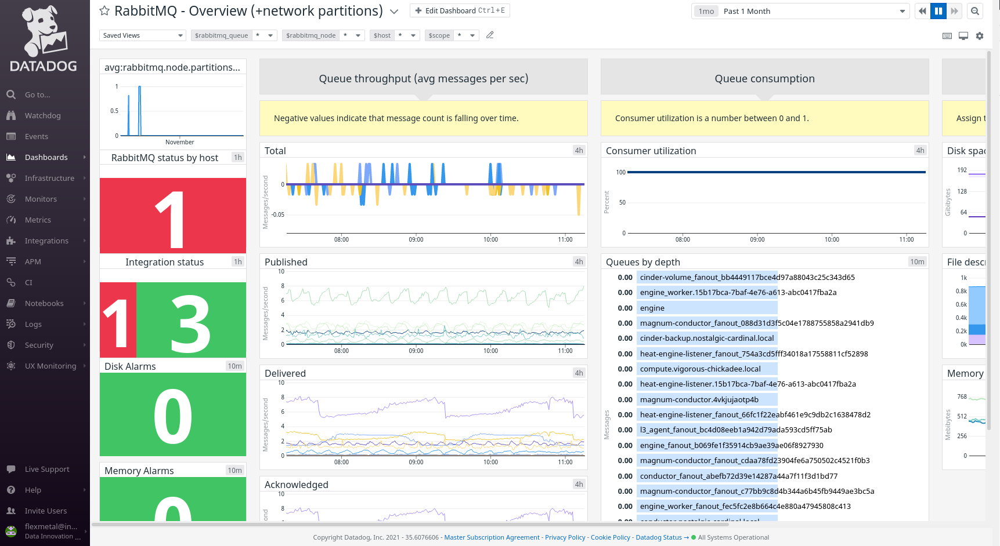
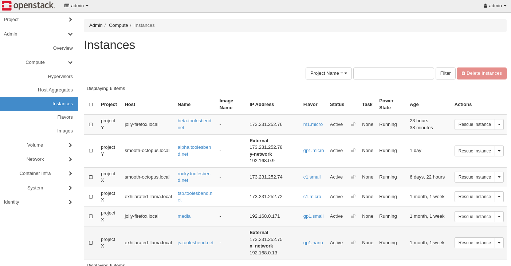
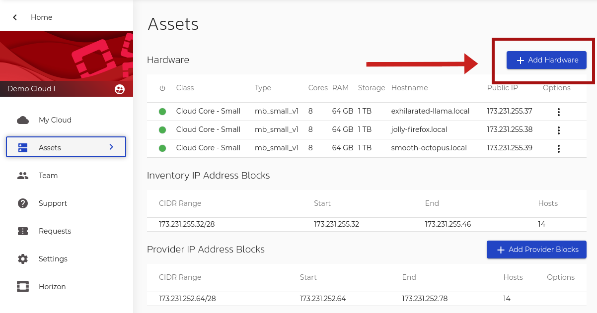

# How to View your Private Cloud's Resource Usage

## Introduction

This guide details how to find the resource usage of your private cloud.
Outlined within this article, we explore how to utilize the Horizon
Dashboard to determine the total memory and compute usage for a project
as well as how to view instances stored on each node. Next, we look at
disk usage by explaining how to briefly interact with your cloud's Ceph
cluster using the command line. Finally, we go over adding and removing
nodes from your Ceph cluster.

## Table of Contents

1.  [Datadog](operators_manual/day-2/resource-usage/cloud-resource-usage#datadog)

2.    - [Resources of a Private
        Cloud](operators_manual/day-2/resource-usage/cloud-resource-usage#resources-of-a-private-cloud)
        
        1.  [View Memory and Compute Usage in
            Horizon](operators_manual/day-2/resource-usage/cloud-resource-usage#view-memory-and-compute-usage-in-horizon)
        2.  [View Instance State Across
            Cluster](operators_manual/day-2/resource-usage/cloud-resource-usage#view-instance-state-across-cluster)
        3.  [How to Access Resource Information from
            Ceph](operators_manual/day-2/resource-usage/cloud-resource-usage#how-to-access-resource-information-from-ceph)

3.  [Adding nodes to your Ceph
    Cluster](operators_manual/day-2/resource-usage/cloud-resource-usage#adding-nodes-to-your-ceph-cluster)

4.  [Removing nodes from your Ceph
    Cluster](operators_manual/day-2/resource-usage/cloud-resource-usage#removing-nodes-from-your-ceph-cluster)

## Datadog

The primary option for accessing resource data for your private cloud is
through the use of Datadog. Datadog allows for the collection of logs
from a wide variety of services. Datadog then has the ability to
visualize and alert based on this log data. Through Datadog you have the
ability to customize logging for your containers as well as any new
services you may add. If you are interested in installing and enabling
Datadog visit [Monitor OpenStack with
Datadog](https://www.datadoghq.com/blog/openstack-monitoring-datadog/).

**Figure 1:** Sample Datadog dashboard

## Resources of a Private Cloud

There are currently three variations to private cloud deployments:
Small, Standard, and Large. All private cloud deployments have a cluster
of three hyper-converged servers but will have different allocations of
memory, storage, and CPU processing power depending on the configuration
and hardware. In addition, you have the option of adding additional
hardware nodes to your cluster.

### View Memory and Compute Usage in Horizon

To view the resources used by your cloud, you have to be the admin user
and assigned to the admin project. Once you are in the admin project,
navigate to **Admin -\> Compute -\> Hypervisors**. This section, lists
the following items:

  - VCPU Usage
  - Memory Usage
  - Local disk usage

**Figure 2:** Hypervisor Summary showing disk and resource usage

### View Instance State Across Cluster

There is also an option to see the location of your instances within
your cluster. To view this information, navigate to **Admin -\> Compute
-\> Instances**. You have the option to see the project, the host, as
well as the IP address, and state.

**Figure 3:** Summary of Instances

### How to Access Resource Information from Ceph

To access information regarding your Ceph cluster's resource pools, you
will need to use Ceph's CLI. These are a summary of some useful resource
monitoring and health commands. For further information, visit Ceph's
[Ceph Administration Tool](https://docs.ceph.com/en/latest/man/8/ceph/)
page.

  - `ceph -s` to check the status of Ceph
  - `ceph df` to list the disk usage overview
  - `ceph health detail` provides details about existing health issues
  - `ceph osd pool ls` to list pools add `detail` for additional details
    regarding replication and health metrics

## Adding nodes to your Ceph Cluster

In order to add additional hardware for your cluster, first review
[Cloud Hardware Best
Practices](operators_manual/day-3/add-remove-hardware-nodes#cloud-hardware-selection-best-practices).
This is to ensure that you have selected the appropriate node for your
cloud. Once you have selected the appropriate node, navigate to
[OpenMetal Central](https://central.openmetal.io) and click on your
**Assets** page. The option to add hardware is located in the top right
corner as **Add Hardware**.

**Figure 4:** Picture of Assets Page where hardware is added to Private
Clouds

## Removing nodes from your Ceph Cluster

To remove nodes from your Ceph Cluster, you must file a support ticket
within [OpenMetal Central](https://central.openmetal.io). A member of
our support staff will be able to further assist you with removing
hardware from your private cloud. For assistance in submitting support
tickets, visit [How to Reach Support](https://central.openmetal.io) in
the heading of our [Introduction to OpenMetal Central
Guide](https://central.openmetal.io).
