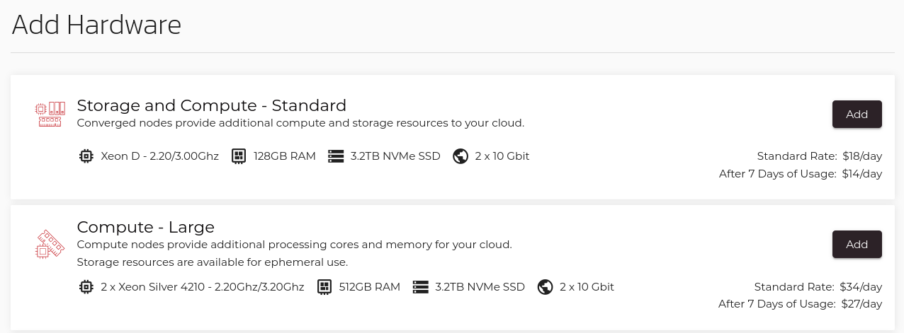
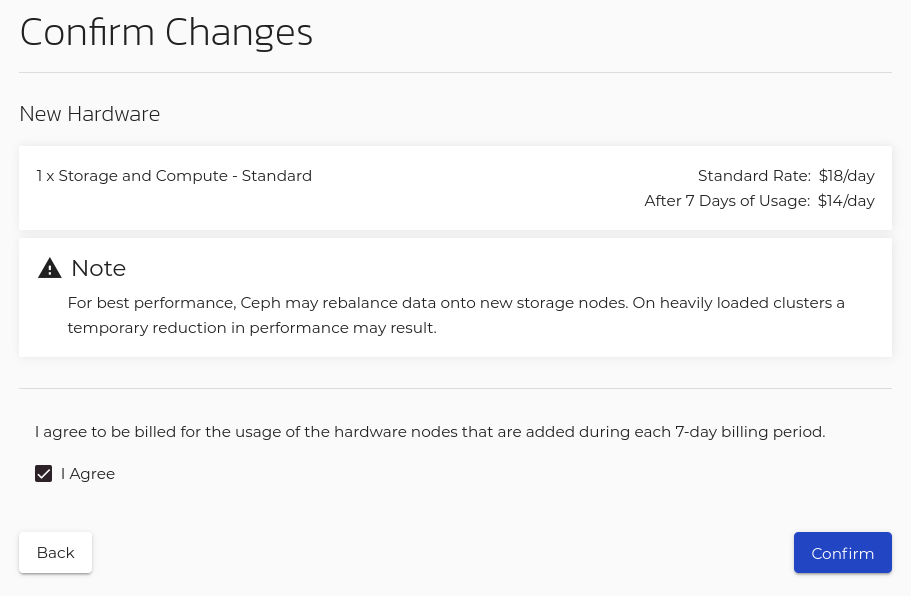
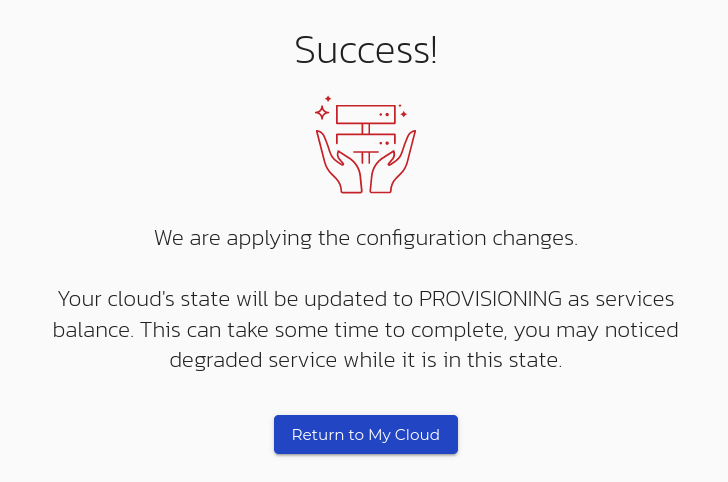

# How to Add or Remove OpenStack Hardware Nodes

## Introduction

OpenMetal Private Clouds can have hardware nodes added to them,
increasing the available compute and storage resources to your cloud.
Similarly, hardware nodes can be removed should resources no longer be
required. In this guide we explain best practices when selecting new
hardware nodes for your cloud. Next we cover how to add nodes, which
types of nodes you can add, and the process for removing nodes from your
cloud.

## Table of Contents

1.    - [Cloud Hardware
        Selection](operators_manual/day-3/add-remove-hardware-nodes#cloud-hardware-selection)
        
        1.  [Types of Private
            Clouds](operators_manual/day-3/add-remove-hardware-nodes#types-of-private-clouds)
        2.  [Types of
            Nodes](operators_manual/day-3/add-remove-hardware-nodes#types-of-nodes)
        3.  [The Benefit of Homogeneous
            Clouds](operators_manual/day-3/add-remove-hardware-nodes#the-benefit-of-homogeneous-clouds)

2.    - [Adding Hardware Nodes to a
        Cloud](operators_manual/day-3/add-remove-hardware-nodes#adding-hardware-nodes-to-a-cloud)
        
        1.    - [How to add a Hardware
                Node](operators_manual/day-3/add-remove-hardware-nodes#how-to-add-a-hardware-node)
                
                1.  [Navigate in OpenMetal Central to Cloud Assets
                    Page](operators_manual/day-3/add-remove-hardware-nodes#navigate-in-openmetal-central-to-cloud-assets-page)
                2.  [View Hardware Node
                    Types](operators_manual/day-3/add-remove-hardware-nodes#view-hardware-node-types)
                3.  [Confirm Hardware Node
                    Addition](operators_manual/day-3/add-remove-hardware-nodes#confirm-hardware-node-addition)
                4.  [Verify Hardware Addition
                    Success](operators_manual/day-3/add-remove-hardware-nodes#verify-hardware-addition-success)

3.    - [Removing Hardware Nodes from a
        Cloud](operators_manual/day-3/add-remove-hardware-nodes#removing-hardware-nodes-from-a-cloud)
        
        1.  [Consider Before
            Removing](operators_manual/day-3/add-remove-hardware-nodes#consider-before-removing)
        2.  [Initial
            Preparation](operators_manual/day-3/add-remove-hardware-nodes#initial-preparation)
        3.  [How to Remove a Hardware Node from a
            Cloud](operators_manual/day-3/add-remove-hardware-nodes#how-to-remove-a-hardware-node-from-a-cloud)

## Cloud Hardware Selection

In this section we outline the types of clouds offered, the types of
nodes you can add to your cloud, and best practices when choosing
hardware for your Private Cloud. Additionally we explain conditions
under which your cloud's Ceph cluster is affected when adding hardware.

### Types of Private Clouds

We currently offer three server sizes for our Private Clouds as seen in
the following image:

**Figure 1:** Private Cloud Core Selections

  - **Cloud Core - Small**: This cluster type should be considered for
    testing environments. Each node has a 1Gbit Network Interface Card
    (NIC). The network throughput across cluster members could be a
    bottleneck.
  - **Cloud Core - Standard**: This cluster type is considered ready for
    production. Each node has a 10Gbit Network Interface Card. The
    network throughput across cluster members should not be a
    bottleneck.
  - **Cloud Core - Large**: Production-ready and provides the most
    resources. Each node also has a 10Gbit Network Interface Card.

### Types of Nodes

The following are the types of nodes that can be added to a cloud.

  - **Storage and Compute - Small**
  - **Storage and Compute - Standard**
  - **Storage and Compute - Large**
  - **Compute - Large**
  - **GPU - A100**

### The Benefit of Homogeneous Clouds

By default, Private Clouds are hyper-converged and include a Ceph
deployment. Generally speaking, Ceph is only as fast as your slowest
node allows, though there are caveats to this. Ceph could be impacted by
the type of nodes added to a cluster due to potential differences in
hardware, such as performance disparity between storage provided by
HDDs, SSDs or NVMes. Having a homogeneous cluster of similarly equipped
nodes will have the best results in terms of performance and data
density. Additionally, while you can add any hardware node to your
cloud, the Network Interface Cards (NICs) for each designation of node
may have a different maximum throughput. If a node with a 1Gbit NIC is
added to a cluster with nodes having 10Gbit NICs, the internal network
traffic is limited by the additional node.

## Adding Hardware Nodes to a Cloud

In this section, we explain the steps needed to add hardware nodes to
your cloud.

The following demonstrates adding a **Storage and Compute - Standard**
node to a **Cloud Core - Standard** cloud.

### How to add a Hardware Node

#### Navigate in OpenMetal Central to Cloud Assets Page

First navigate in OpenMetal Central to your cloud's details page. Next
follow the **Assets** link on the left. This page shows you details
about your cloud's current assets and also allows you to add a new
hardware node. To add a new hardware node, select the **Add Hardware**
button located at the top right.

**Figure 2:** Add Hardware

#### View Hardware Node Types

The next screen presents you with a list of available hardware nodes as
can be seen in the following screenshot.

**Figure 3:** Available Hardware List

Hardware specifications and the cost per day are listed with each
available offering.

Select the appropriate hardware node for your cloud. To add a new
hardware node, select the **Add** button associated with the node type
you would like. Next, specify the amount of nodes to add from the drop
down.

#### Confirm Hardware Node Addition

After choosing the number of nodes to add, confirm the additional
hardware.

**Figure 4:** Confirm Addition of new Hardware

After the system processes the request a success message is returned as
can be seen below:

**Note** -- Adding a hardware node can take around an hour to complete.
An email is sent to the primary account's address when complete.

**Figure 5:** Hardware Addition Success

Should you navigate back to your cloud's assets page, you can visually
confirm the additional node by inspecting the hardware associate with
your cloud. In this example, there is a red dot next to the newly added
node, indicating it is still being added to the cloud.

**Figure 6:** Cloud Assets List, Newly Added Node but not Available

#### Verify Hardware Addition Success

An email is sent to your account upon successfully adding this node.
Navigate to your cloud's assets page to confirm the newly added node.

**Figure 7:** Successful Hardware Node Addition

## Removing Hardware Nodes from a Cloud

In this section, we outline the steps required to remove a hardware node
from your cloud.

There is not a native feature in OpenMetal Central allowing you to
remove hardware nodes from your cloud. Should you need to remove a
hardware node from your cloud, consult with your Account Manager first
or submit a ticket through OpenMetal Central. It is very important all
data required from this node is copied elsewhere prior to making a
request to remove a hardware node. You can help facilitate the process
of removing the node by [migrating any running
instances](operators_manual/day-2/live-migrate-instances) from it to
another node.

### Consider Before Removing

At all times, your cloud must have three hyperconverged control plane
nodes running to have a fully functioning OpenStack cloud. As such, the
node being removed cannot be a control plane node.

Control plane nodes in OpenMetal Central are prefixed with **Cloud
Core** and can be distinguished from other nodes by inspecting the
**Class** column in your cloud's assets page in OpenMetal Central.

For example, in the following screenshot, the first three nodes are
control plane nodes:

**Figure 8:** Control Plane nodes

The last node, classified by **Storage and Compute - Standard** is not a
control plane node, meaning it does not run all the core OpenStack
services.

Our support will review your request to ensure requirements are met
prior to removal.

### Initial Preparation

To prepare for removal of a hardware node, migrate any instances to
another node that has compute services running. All hyperconverged nodes
run OpenStack's compute service. For instruction regarding migrating
instances to another node, see the [How to Live Migrate
Instances](operators_manual/day-2/live-migrate-instances) guide.

### How to Remove a Hardware Node from a Cloud

To remove a hardware node from a cloud a ticket must be submitted with
the request through OpenMetal Central. Specify the hostname or IP
address of the node you wish to be removed and an agent will review the
request.
