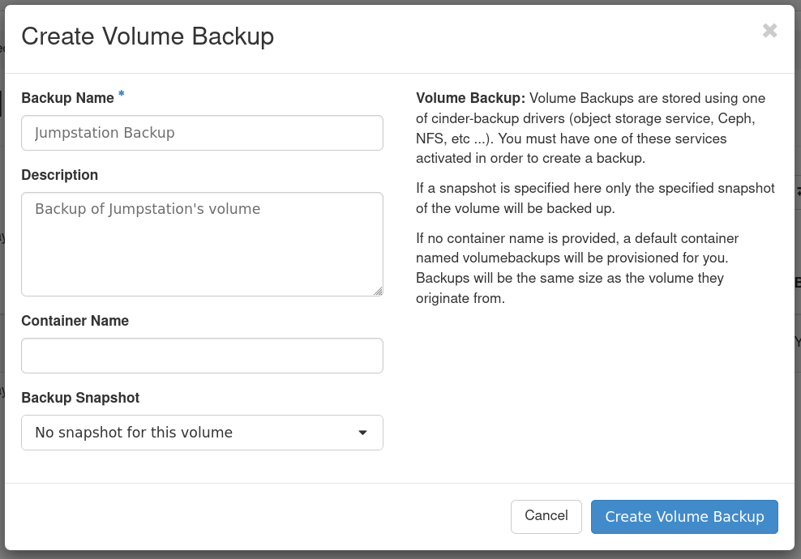

# Create and Restore Volume Backups

## Introduction

With Private Clouds, you have the ability to create backups and
snapshots of your volume data. If a volume's data goes corrupt or is
removed by mistake, having a copy of that data could be invaluable. In
this guide, we explain how to create and recover volume backups using
Horizon.

## Create a Volume Backup

Navigate in Horizon to **Project -\> Volume -\> Volumes**.

**Figure 1:** Volumes List

Create a backup of your volume by selecting from the drop down **Create
Backup**.

**Figure 2:** Create Volume Backup Form

- **Backup Name**: Specify a name for the volume backup
- **Description**: Provide a description if necessary
- **Container Name**: Leave this blank otherwise the volume backup
    cannot be created. Horizon tells you if this field is blank, the
    backup is stored in a container called `volumebackups`, but this is
    not the case with our configuration. With Private Clouds, all volume
    backups created this way are stored in the Ceph pool called
    `backups`.
- **Backup Snapshot**: If applicable specify a snapshot to create a
    backup from

After submitting the form, you are navigated to **Project -\> Volume -\>
Volume Backups** where you can see the volume you just created a backup
of.

**Figure 3:** Volume Backup List

### Test Volume Backups

Creating backup copies of your important data is only one part of having
a solid backup and recovery plan. Additionally, consider testing
backed-up data to ensure if something unexpected does happen that
restoring your backups will actually be useful. To test volume backups,
you can restore a volume backup within OpenStack alongside the original
volume and compare the contents.

## Restore a Volume Backup

To restore a volume backup, being by navigating in Horizon to **Project
-\> Volume -\> Volume Backups**.

Next, find the volume backup you wish to restore and from its drop down
on the right, select **Restore Backup**.

**Figure 4:** Volume Backup List

Choose the volume to restore to, or have the system restore the backup
to a new volume.

## Ceph, Volumes, and Data Durability

When volume backups are created, they are stored in your cloud's Ceph
cluster in a pool called `backups`. By default, the Ceph cluster is
configured with host level replication across each of your cloud's three
control plane nodes. With this configuration, your cloud could suffer
losing all but one Ceph node and still retain all of the cluster's data.
For more about how your Ceph cluster was configure, see the heading
**Default Configuration for the Ceph Cluster** in the [Introduction to
Ceph](../day-2/introduction-to-ceph) guide.

## Store Data Outside of the Cloud

Taking data backups a step further, consider storing critical data
outside of the cloud. Storing data both in the cloud's Ceph cluster as
well as outside of it increases the failure domain.

With Ceph you can use [RBD
mirroring](https://docs.ceph.com/en/latest/rbd/rbd-mirroring/), which
effectively is a way to mirror your Ceph cluster's data to another Ceph
cluster.
