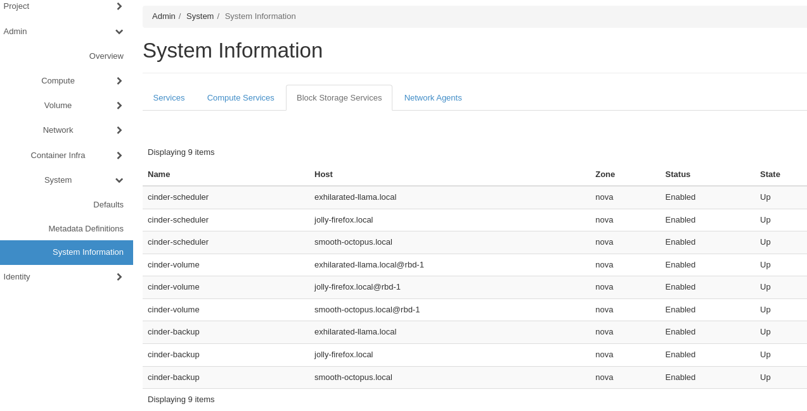
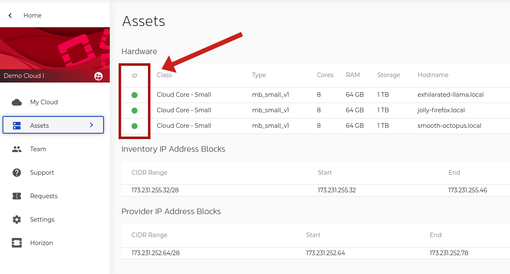

# OpenStack Disaster Planning, Testing, and Recovery

## Introduction

While OpenStack is a resilient platform in High Availability (HA)
deployments, disasters that cause a hardware node or an entire cloud to
fail may still occur. Due to the potential for unexpected events to
cause your business or operations to fail, we suggest planning for
disaster events. In this guide, we emphasize the importance of planning
for disasters and outline strategies to consider when creating your
disaster recovery plan.

## Table of Contents

1.    - [Disaster Recovery
        Strategies](operators_manual/day-3/disaster-recovery.rst#disaster-recovery-strategies)
        
        1.  [Recovery
            Objectives](operators_manual/day-3/disaster-recovery.rst#recovery-objectives)
        2.  [Off-site
            Backups](operators_manual/day-3/disaster-recovery.rst#off-site-backups)
        3.  [RBD Mirroring with
            Ceph](operators_manual/day-3/disaster-recovery.rst#rbd-mirroring-with-ceph)

2.    - [Handling a Hardware
        Failure](operators_manual/day-3/disaster-recovery.rst#handling-a-hardware-failure)
        
        1.  [Determine Hardware Node
            Failure](operators_manual/day-3/disaster-recovery.rst#determine-hardware-node-failure)
        2.  [Cluster
            Failure](operators_manual/day-3/disaster-recovery.rst#cluster-failure)

3.  [Cloud Monitoring with
    Datadog](operators_manual/day-3/disaster-recovery.rst#cloud-monitoring-with-datadog)

4.  [Contact
    Support](operators_manual/day-3/disaster-recovery.rst#contact-support)

5.  [Additional
    Reading](operators_manual/day-3/disaster-recovery.rst#additional-reading)

## Disaster Recovery Strategies

Disaster recovery varies greatly depending on the needs of your
organization. Your disaster recovery plan should involve analyzing your
company's most valuable data. This audit should include an inventory of
documents, databases, and systems that are deeply involved in the
revenue-generating aspects of your business. As an infrastructure
provider, we also have the responsibility to maintain the integrity of
our facilities to the best standards and practices to safeguard your
data. In addition to our responsibilities, you should take the
additional steps necessary to protect the integrity of your data against
potential impacts on your private cloud.

### Recovery Objectives

The objectives behind a disaster recovery plan fall into two categories:

  - **Recovery Point Objectives** - This is a specific point in time
    that data must be backed up to resume business.
  - **Recovery Time Objectives** - Length of time that a system can be
    offline before the business is negatively impacted.

Consider the above objectives when determining the needs of your
disaster recovery strategies. In recovery point objectives, determining
the frequency of your backups is critical to your disaster strategy.
Recovery time objectives are based on the amount of lost revenue per
unit of lost time. This means that every hour or minute that certain
systems are offline can greatly impact a business.

### Off-site Backups

To have an effective disaster recovery plan, we stress the use of an
off-site backup solution. Off-site backups are a critical component to
preventing catastrophic loss of data and limiting the blast radius of an
outage. Although some services in OpenMetal are highly available, high
availability does not protect against unforeseen natural disasters. In
the event of a hurricane, flood, or other unforeseen circumstance, it
could be possible that you must recover data from a different
geographical location. It is highly recommended that off-site backups
are used for the most mission-critical data.

### RBD Mirroring with Ceph

Private Clouds by default use Ceph as a shared storage backend. As part
of your disaster recovery plan, consider using Ceph's [RBD
mirroring](https://docs.ceph.com/en/latest/rbd/rbd-mirroring/) feature
to mirror important data to another Ceph cluster, in a geographically
different data center location. **Note** that we currently only provide
one data center in which to host your Private Cloud.

## Handling a Hardware Failure

Great care is taken to monitor and maintain our infrastructure. However,
in the event of hardware failure, it might be necessary to diagnose
these issues. If you believe you are experiencing hardware failure,
contact our support. Two possible hardware-related issues are failure of
a hardware node and failure of an entire cloud. The following sections
outline how to diagnose hardware failure.

### Determine Hardware Node Failure

To quickly get the status of your cloud's control plane nodes, check the
running system services in Horizon. To do so, log in as an administrator
to Horizon and navigate to **Admin -\> System -\> System Information**.
On this page are tabs separating all OpenStack services, including the
APIs, Compute, Block Storage, and Network Agents. A service's state is
indicated by the **State** column. If a service is up, the value is
reflected as "Up". If a service is down, the value is reported as
"Down". Click through each tab to see each service's status. A good
indicator that a control plane node is down is if you see "Down" under
the **State** column for all services of a particular node.

**Figure 1:** OpenStack System Information

### Cluster Failure

If your entire Private Cloud has failed, the signs will be readily
apparent. If you are using monitoring software such as Datadog or
Nagios, you will be alerted to your nodes being offline. In addition to
being alerted, you will be unable to access your assets.

**Note:** In some instances, it is also possible to see a failure of
your nodes within OpenMetal central. To view the status of these nodes,
go to the assets page of OpenMetal central, and under the hardware
section, there is a green indicator icon reflecting the current status
of your nodes. If the icon is yellow or red, then the issue is likely
hardware-related.

**Figure 2:** Assets Page of OpenMetal Central

## Cloud Monitoring with Datadog

Datadog is an optional cloud monitoring service we provide for OpenMetal
Private Clouds. Should you want to add this feature to your cloud,
contact your Account Manager or submit a support ticket in OpenMetal
Central.

## Contact Support

If you are experiencing hardware failure or any other issues with your
Open Metal Private Cloud, [Contact
Support](https://central.openmetal.io/).

## Additional Reading

For more regarding OpenStack Disaster Recovery, see:

  - RedHat's [Disaster Recovery Enablement in
    OpenStack](https://www.redhat.com/en/blog/disaster-recovery-enablement-openstack)
  - InMotion Hosting's [What is Disaster Recovery as a Service
    (DRaaS)?](https://www.inmotionhosting.com/support/product-guides/private-cloud/what-is-disaster-recovery-as-a-service-draas/)
  - OpenStack's [Disaster Recovery Wiki
    Page](https://wiki.openstack.org/wiki/DisasterRecovery)
