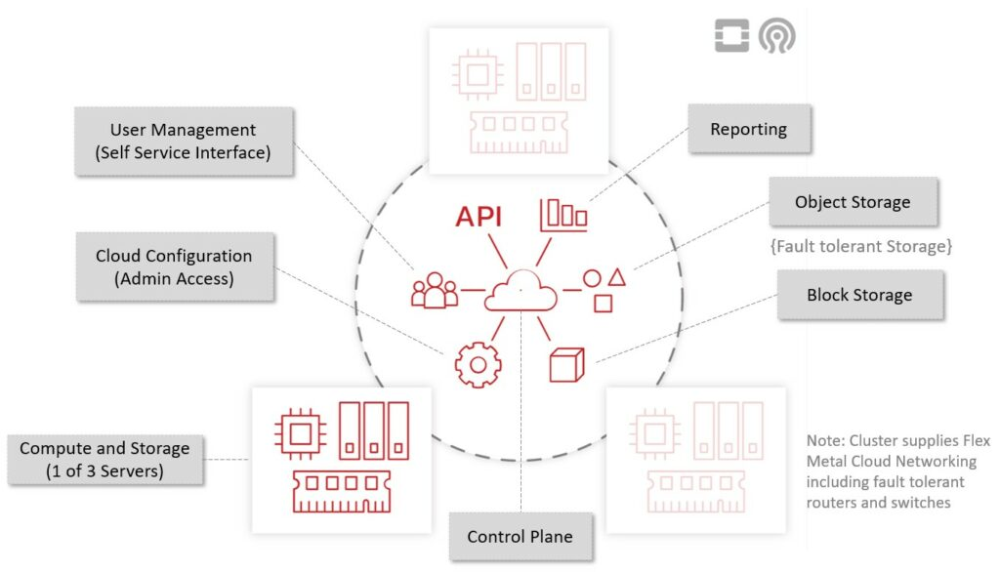

# OpenStack Operator's Manual - Private Cloud Core

## Introduction

Welcome to the OpenStack Operator's Manual for your OpenMetal Private
Cloud\! There are several phases of creating an OpenStack cloud and most
of the public documentation focuses on the initial creation of a cloud.
With OpenMetal, we provide a full private OpenStack cloud where you
start as an **Operator**. This manual, with a few noted exceptions,
applies to any OpenStack that has been provisioned to OpenStack.org's
[RefStack](https://docs.openstack.org/refstack) standard. If you are
reading this, it assumed you have followed the OpenMetal Central Process
to provision your cloud already. Visit [OpenMetal Central to sign up or
sign in](https://central.openmetal.io/). For product details please
visit the [Private Cloud](https://openmetal.io/products/private-cloud/hosted/)
page.

## Getting Started with the Operator's Manual

Guides are grouped into **Days**, of which there are four. A description
of each day and their associated guides follows in the Table of
Contents.

### Why Days?

Days have been selected to break down the information covered in this
manual into categories. Loosely speaking, Day 1 is allocated for initial
set up and configuration. Day 2 is for operations and maintenance. Day 3
has to do with scaling a cloud, ensuring your data is backed up, and how
to restore it. Day 4 is for more advanced administration topics,
introducing how to make general changes to your cloud using Kolla
Ansible, and other topics.

### Brief Summary of each Day

- Day 1: Initial setup of cloud
- Day 2: Cloud administration and maintenance
- Day 3: Scaling the cloud and disaster recovery
- Day 4: Advanced administration, introducing Kolla Ansible

### Operator's Manual Audience

The audience for this manual is experienced Linux System Administrators
who are new to OpenStack.

## Table of Contents

### Day 1

Day 1 generally refers to initial setup, which in our case is the
process of getting started with a Private Cloud Core OpenStack Cloud. We
introduce you to OpenMetal Central, how to view the assets that comprise
your cloud, and how to get support from our staff.

1. [Introduction to OpenMetal and your Private Cloud Core](day-1/intro-to-openmetal-private-cloud)
2. [Getting Started with OpenStack Horizon](day-1/horizon/getting-started-with-horizon)
3. [Create an OpenStack User and Project in Horizon](day-1/horizon/create-user-project)
4. [Manage and Upload Images in OpenStack Horizon](day-1/horizon/images)
5. [How to Create an Instance in OpenStack Horizon](day-1/horizon/create-first-instance)
6. [How to Install and Use OpenStackClient](day-1/command-line/openstackclient)
7. [Create SSH Key Pair for an OpenStack Control Plane Node](day-1/command-line/create-ssh-key)

### Day 2

Day 2 initially explains briefly how your Private Cloud was deployed.
Next we cover OpenStack administration by explaining how to perform
maintenance tasks for your cluster's hardware nodes.

1. [How Private Clouds are Deployed](day-2/private-cloud-deployment-overview)
2. [Introduction to Ceph](day-2/introduction-to-ceph)
3. [How to Check Ceph's Status and Disk Usage](day-2/check-ceph-status-disk-usage)
4. [Maintaining OpenStack Software Updates](day-2/maintenance)
5. [View OpenStack Resource Usage](day-2/resource-usage/cloud-resource-usage)
6. [How to Live Migrate Instances](day-2/live-migrate-instances)

### Day 3

Day 3 has to do with how you can scale your cloud by adding more
hardware nodes to it. Next we get into preparing for disaster recovery
by explaining best practices relating to keeping your data safe. We
provide a general outline for how you can recover from a disaster.

1. [How to Add or Remove Hardware Nodes](day-3/add-remove-hardware-nodes)
2. [How to Add Additional Provider IP Blocks](day-3/add-provider-ips)
3. [Create and Restore Volume Backups](day-3/create-volume-backups)
4. [How to Create OpenStack Service Configuration Backups](day-3/create-openstack-service-backups)
5. [OpenStack Disaster Planning, Testing, and Recovery](day-3/disaster-recovery)

### Day 4

In Day 4, we cover advanced OpenStack administration through Kolla
Ansible, the primary system used to deploy a Private Cloud. Through this
system, we explain how configuration changes to your cloud can be made.
Next, we detail a few common troubleshooting scenarios and their
solutions. Finally we briefly cover automation techniques possible in
your cloud through the use of OpenStack's Heat service and through
HashiCorp's Terraform application.

1. [How to Prepare and Use Kolla Ansible](day-4/kolla-ansible/prepare-kolla-ansible)
2. [Enable TLS Using Kolla Ansible](day-4/kolla-ansible/enable-tls)
3. [Enable ElasticSearch and Kibana Logging using Kolla Ansible](day-4/kolla-ansible/enable-elk)
4. [Security and Your OpenMetal Private Cloud](day-4/security/security-best-practices)
5. [How to Prepare and Use Ceph Ansible](day-4/ceph-ansible/prepare-ceph-ansible)
6. [OpenStack Watcher Demonstration](day-4/watcher/watcher-demo)
7. [Troubleshooting RabbitMQ](day-4/troubleshooting/rabbitmq)
8. [How to Redeploy RabbitMQ using Kolla Ansible](day-4/kolla-ansible/redeploy-rabbitmq)
9. [Troubleshooting Ceph](day-4/troubleshooting/ceph)
10. [Guidelines for Searching through Logs](day-4/troubleshooting/log-filtering)
11. [OpenStack Automation through Heat](day-4/automation/heat)
12. [Automate Infrastructure using Terraform](day-4/automation/terraform)
