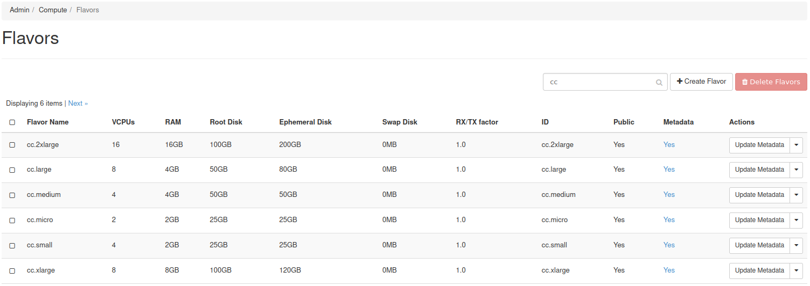
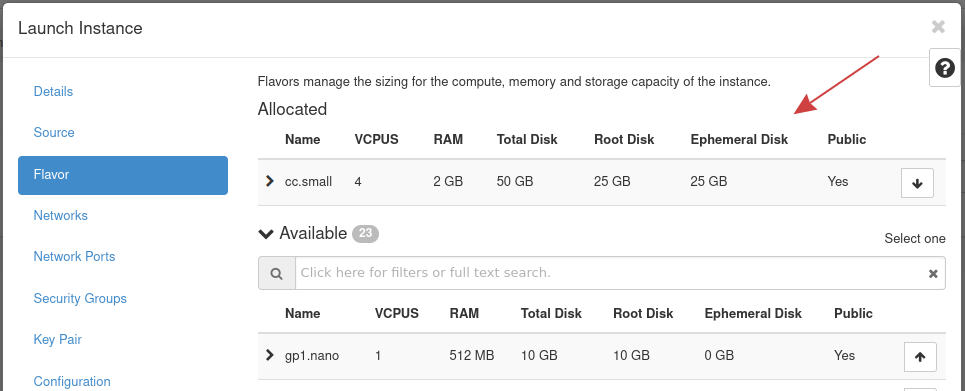

# Spin up an Instance with Ephemeral Storage

## Introduction

It is now possible to make use of ephemeral storage with the Private
Cloud Core platform. This storage type is available through additional
`Compute` nodes.

In this guide, you will learn how to create an instance that makes use
of ephemeral storage.

-----

### What is Ephemeral Storage?

Ephemeral storage is fast, temporary disk space that does not persist
after the instance is terminated. This type of storage is well-suited
for CI/CD job runners, distributed worker nodes or database systems, or
anything that requires fast storage or has inherent data redundancy.

For an overview of how data can be stored, see [Storage
Concepts](https://docs.openstack.org/arch-design/design-storage/design-storage-concepts.html)
in the OpenStack documentation.

### Prerequisites

To use ephemeral storage, you must have an additional `Compute` node
added to the Private Cloud Core.

To add this node type, reach out to your account manager who can add
this for you. We do not currently support adding this node through
OpenMetal Central.

**Note\!** -- The `Storage and Compute` nodes do not make use of
ephemeral storage\! These nodes, when added, join the existing Ceph
cluster.

### Background

With our latest update, a new class of flavors have been added, that
once set, ensure your instance is spun up on an ephemeral storage
Compute node. We use LVM to manage the local NVMe drive, providing
ephemeral storage.

Flavors that set ephemeral storage:

- cc.micro
- cc.small
- cc.medium
- cc.large
- cc.xlarge
- cc.2xlarge

To see the new flavors, as an administrative user, navigate in Horizon
to **Admin -\> Compute -\> Flavors**. The flavors prefixed with `cc` are
what allow for ephemeral storage.

## Procedure

To have an instance use ephemeral storage, during instance creation, set
the flavor to any prefixed with "cc". `cc.small` is an example flavor
that allows an instance's storage to be ephemeral.

The following demonstrates setting the `cc.small` flavor, providing 25GB
of ephemeral disk space.

Listed under the **Ephemeral Disk** column is the amount of ephemeral
storage this flavor sets.

### Instance Boot Considerations

When booting an instance with the ephemeral flavors, there are several
boot source options available.

Of those options, these are important to consider:

- **Boot Sources**:
  - Image
  - Volume

- **Boot from Image**: When booting an instance from an image, the image
    is copied from Glance into the Compute node's local LVM volume and so
    the operating system is running on ephemeral storage.

- **Boot from Volume**: An instance booted from a volume means the
    operating system is loaded from Ceph.

### How can Ephemeral Storage be Used?

When an instance is spun up, its ephemeral storage can be accessed using
the path `/mnt`.

-----

#### Example

Instance `ephemeral-1` was spun up using the `cc.small` flavor.

Using SSH and the `df` command, the varying mount points can be seen:

    [root@ephemeral-1 ~]# df -h
    Filesystem      Size  Used Avail Use% Mounted on
    devtmpfs        877M     0  877M   0% /dev
    tmpfs           909M     0  909M   0% /dev/shm
    tmpfs           909M   17M  892M   2% /run
    tmpfs           909M     0  909M   0% /sys/fs/cgroup
    /dev/vda1        25G  2.5G   23G  10% /
    /dev/vdb         25G  1.1G   24G   5% /mnt
    tmpfs           182M     0  182M   0% /run/user/1000

In this list, `/dev/vdb` is the block device mapped directly to the NVMe
drive through the path `/mnt`.

**Note\!** -- Some operating systems format the ephemeral block device
with the `VFAT` file system. You may consider reformatting the device to
another file system, like `ext4`.

The following is a CentOS 8 instance showing the file system types where
`/dev/vdb` has file format `VFAT`:

    [centos@ephemeral-vfat ~]$ df -hT
    Filesystem     Type      Size  Used Avail Use% Mounted on
    devtmpfs       devtmpfs  1.8G     0  1.8G   0% /dev
    tmpfs          tmpfs     1.9G     0  1.9G   0% /dev/shm
    tmpfs          tmpfs     1.9G   17M  1.9G   1% /run
    tmpfs          tmpfs     1.9G     0  1.9G   0% /sys/fs/cgroup
    /dev/vda1      xfs        50G  1.7G   49G   4% /
    /dev/vdb       vfat       50G   32K   50G   1% /mnt
    tmpfs          tmpfs     374M     0  374M   0% /run/user/1000

## Performance

This section goes into detail about the performance differences between
an LVM ephemeral device and one loaded from Ceph.

An instance called **ephemeral** running CentOS 8 has been created. This
instance is using the `cc.medium` flavor, providing 50GB of ephemeral
storage. The operating system is booted from a Ceph volume.

The following is a test of the read and write speeds comparing the Ceph
volume to the ephemeral drive. Random and sequential read and write
tests are performed. In addition, the ephemeral device is formatted to
ext4.

-----

### Convert to ext4

Using SSH and the command `df -hT`, the file systems can be seen:

    [root@ephemeral ~]# df -hT
    Filesystem     Type      Size  Used Avail Use% Mounted on
    devtmpfs       devtmpfs  1.8G     0  1.8G   0% /dev
    tmpfs          tmpfs     1.9G     0  1.9G   0% /dev/shm
    tmpfs          tmpfs     1.9G  8.5M  1.9G   1% /run
    tmpfs          tmpfs     1.9G     0  1.9G   0% /sys/fs/cgroup
    /dev/vda1      xfs        50G  2.2G   48G   5% /
    /dev/vdb       vfat       50G   32K   50G   1% /mnt
    tmpfs          tmpfs     374M     0  374M   0% /run/user/1000

The ephemeral drive in this output is `/dev/vdb` and is mounted to
`/mnt`. The file system is set to `VFAT` and will be changed to `ext4`.

This example uses `umount /mnt && mkfs.ext4 /dev/vdb` to accomplish
formatting the drive to ext4:

    [root@ephemeral ~]# umount /mnt && mkfs.ext4 /dev/vdb
    mke2fs 1.45.6 (20-Mar-2020)
    /dev/vdb contains a vfat file system
    Proceed anyway? (y,N) y
    Creating filesystem with 13107200 4k blocks and 3276800 inodes
    Filesystem UUID: 637150f9-a48b-4fd0-9fcc-62fb23d800b5
    Superblock backups stored on blocks:
            32768, 98304, 163840, 229376, 294912, 819200, 884736, 1605632, 2654208,
            4096000, 7962624, 11239424
    
    Allocating group tables: done
    Writing inode tables: done
    Creating journal (65536 blocks): done
    Writing superblocks and filesystem accounting information: done

Once the drive is reformatted, mount it to `/mnt` again and confirm the
file system:

    [root@ephemeral ~]# mount -a
    [root@ephemeral ~]# df -hT | grep vdb
    /dev/vdb       ext4       49G   53M   47G   1% /mnt

### Performance Tests

Now that the ephemeral drive's file system is set to `ext4`, the
performance of disk reads and writes will be compared to the root drive
( `/` ).

The application [fio](https://github.com/axboe/fio) is used to test disk
performance.

The tests performed are:

- Random disk reads and writes
- Sequential disk reads and writes

### Results

Above each table are the parameters passed to `fio`.

These tests were performed within a **Private Cloud Core - Small** using
an additional **Compute - Large** node.

-----

`rw=randread bs=4k size=2g numjobs=1 iodepth=2 runtime=60 end_fsync=1
ioengine=posixaio`

\+----------------------------------------------------+ | Random Reads |
+===============+===================+================+ | | Bandwidth
(MiB/s) | IOPS (average) |
+---------------+-------------------+----------------+ | LVM Ephemeral |
34.4 | 8819 | +---------------+-------------------+----------------+ |
Ceph | 8.5 | 2125 |
+---------------+-------------------+----------------+

`rw=randwrite bs=4k size=2g numjobs=1 iodepth=2 runtime=60 end_fsync=1
ioengine=posixaio`

\+----------------------------------------------------+ | Random Writes
| +===============+===================+================+ | | Bandwidth
(MiB/s) | IOPS (average) |
+---------------+-------------------+----------------+ | LVM Ephemeral |
285 | 72998 | +---------------+-------------------+----------------+ |
Ceph | 94.1 | 39305 |
+---------------+-------------------+----------------+

`rw=read bs=4k size=2g numjobs=1 iodepth=2 runtime=60 end_fsync=1
ioengine=posixaio`

\+----------------------------------------------------+ | Sequential
Reads | +===============+===================+================+ | |
Bandwidth (MiB/s) | IOPS (average) |
+---------------+-------------------+----------------+ | LVM Ephemeral |
302 | 83314 | +---------------+-------------------+----------------+ |
Ceph | 197 | 50210 |
+---------------+-------------------+----------------+

`rw=write bs=4k size=2g numjobs=1 iodepth=2 runtime=60 end_fsync=1
ioengine=posixaio`

\+----------------------------------------------------+ | Sequential
Writes | +===============+===================+================+ | |
Bandwidth (MiB/s) | IOPS (average) |
+---------------+-------------------+----------------+ | LVM Ephemeral |
294 | 76620 | +---------------+-------------------+----------------+ |
Ceph | 104 | 40244 |
+---------------+-------------------+----------------+
