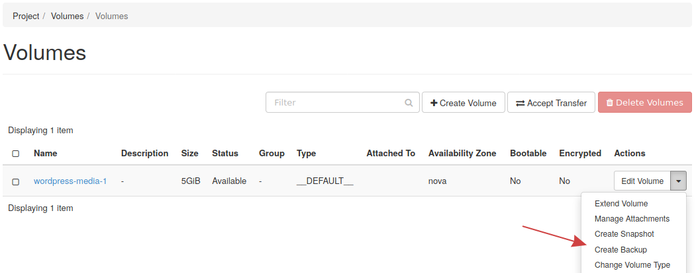
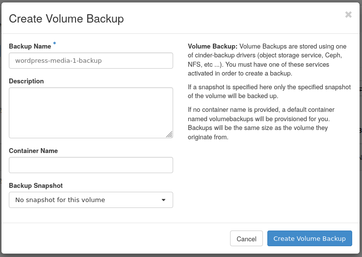

# How to Make Backups in OpenStack

Having a solid backup strategy is important in the event where data is
lost and you need to recover it. In this guide, you will learn how to
make backups of instance data, volumes, and how to store backups outside
of the OpenStack cloud.

**Considerations for Testing Backups**

Backups should not only be created, but should be confirmed they contain
all data as well as be restored and tested as part of a polished backup
strategy. Consider a disaster recovery scenario where you have known
backups, however they were never tested, and are not usable due to some
circumstance.

-----

## Instance Backups

### How to Create an Instance Backup

This section demonstrates how to create an instance backup using Horizon
by creating a snapshot.

-----

**Step 1** -- Create Instance Backup

To create a backup of an instance, navigate to **Project -\> Compute -\>
Instances**.

From there, find the instance in question and click the **Create
Snapshot** button. This starts the process of backing up the instance
data and may take some time to complete.

**Step 2** -- Confirm Backup Completion

To confirm the snapshot was created successfully, navigate to **Project
-\> Compute -\> Images**, then find the snapshot in the list.

### How to Recover an Instance Backup

This section explains how to recover an instance backup using Horizon.

-----

**Step 1** -- Recover snapshot

To recover the instance snapshot, navigate to **Project -\> Compute -\>
Instances** and launch a new instance. When filling out the form, ensure
you select as the boot source **Instance Snapshot** and choose the
snapshot to restore.

**Step 2** -- Confirm restoration

To confirm the snapshot has restored list the instances in Horizon and
check the status column. Check to ensure everything still works as
expected within that instance.

-----

## Volume Backups

### How to Create a Volume Backup

In addition to creating instance snapshots, you can also create backups
of volumes in Horizon. This is important when a persistent volume is
used and you want to create backup copies of it.

-----

**Step 1** -- Create volume backup

To back up a volume, navigate to **Project -\> Volumes -\> Volumes**,
then to the volume in you are working with, select from the drop down on
the right, **Create Backup**.

Fill out the following form with at least the name of the backup and any
other fields needed.

**Step 2** -- Confirm volume backup creation

To confirm the backup created successfully, navigate to **Project -\>
Volumes -\> Backups**, then locate the backup in the list, and take note
of the **Status** column. You should see **Available** indicating the
backup is complete and ready to use.

-----

### How to Recover a Volume Backup

This section will explain the steps needed to recover a volume backup
using Horizon.

-----

**Step 1** -- Find the volume backup

To find the volume backups, navigate to **Project -\> Volumes -\>
Backups** and confirm the backup is in the list.

**Step 2** -- Restore volume backup

To restore this backup, choose from the listing drop down on the right,
the **Restore Backup** option.

Choose the **Create a New Volume** option to recover this backup into a
new volume, that can be later attached to an instance as needed.

